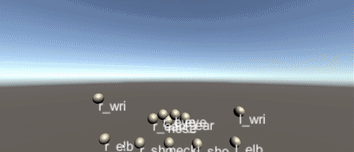
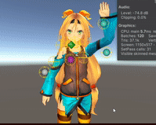

# Vtuber Framework Unity and Python
This is a VTuber framework made with unity, it can track your movements and Expressions in 3d

## Features
* 3D Body Tracking
* Expression Analisis

## TODO
* Optimization of the code
* Documentation

## More images

## How to Use
1. Go to the "TrackigBackend"
2. Install Requirements
3. Play the backend
4. Open the project on unity 2017.3 or greater.
5. Play the unity frontend
6. 

## Licence
This proyect uses Django, tweepy, dropbox libraries, also was made to work with heroku but everything else was totally handcrafted by me, so the licence is MIT, use it as you want.

<h3 align="center">Let's connect 😋</h3>

 &nbsp; &nbsp;
 &nbsp; &nbsp;
 &nbsp; &nbsp;
 &nbsp; &nbsp;
